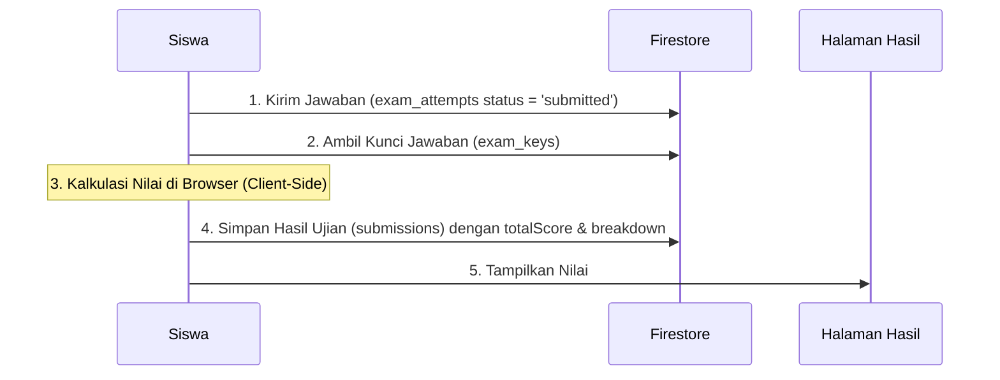
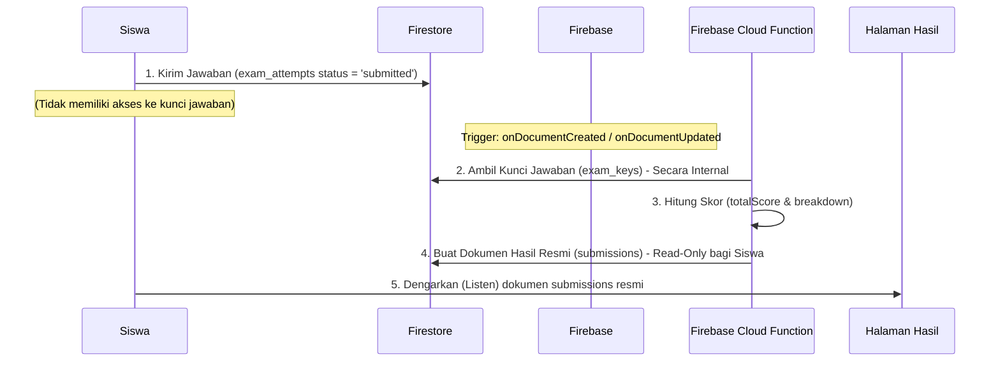

# Rencana Peningkatan Keamanan: Server-Side Scoring Engine

Dokumen ini mendokumentasikan rencana peningkatan arsitektur pengisian nilai (scoring) CBT dari sisi klien (Client-Side) ke sisi server (Server-Side). Peningkatan ini bertujuan untuk menutup celah manipulasi nilai oleh siswa melalui konsol browser (Developer Tools).

---

## 1. Arsitektur Saat Ini (MVP) & Risikonya

Saat ini, kalkulasi nilai dilakukan langsung di perangkat siswa (Client-Side) setelah ujian selesai:



### Risiko Keamanan:
Karena browser siswa yang menghitung dan menulis dokumen `submissions` ke Firestore, siswa yang memiliki kemampuan teknis dapat:
1. Membuka Konsol Developer Tools di browser.
2. Mengintersep atau memodifikasi variabel `totalScore` sebelum dikirim.
3. Menulis langsung dokumen baru ke koleksi `/submissions` dengan nilai `100` menggunakan SDK Firestore Client, karena aturan Firestore saat ini mengizinkan pembuatan dokumen oleh siswa selama tipe datanya sesuai.

---

## 2. Arsitektur Masa Depan yang Diusulkan (Server-Side Scoring)

Untuk menutup celah di atas, proses kalkulasi nilai dipindahkan sepenuhnya ke lingkungan server yang aman (Trusted Environment) menggunakan **Firebase Cloud Functions** atau backend khusus:



### Keuntungan Arsitektur Ini:
* **Zero Trust Client:** Siswa tidak memiliki hak untuk menulis atau memodifikasi nilai mereka sendiri.
* **Kunci Jawaban Tersembunyi:** Siswa tidak pernah mengunduh kunci jawaban (`exam_keys`) ke browser mereka, bahkan setelah ujian selesai. Kunci jawaban tetap berada di server.
* **Integritas Data:** Nilai yang tersimpan di database dijamin 100% valid karena dihitung oleh kode server yang tidak bisa dimodifikasi oleh siswa.

---

## 3. Rencana Implementasi Teknis

### A. Perubahan Alur Kerja di Browser Siswa (`examPage.js`)
Siswa hanya mengirimkan jawaban mentah, tanpa menghitung skor:
1. Saat ujian selesai (atau waktu habis), client mengubah status dokumen di `exam_attempts/{attemptId}` menjadi `submitted`.
2. Client mengirimkan daftar jawaban akhir (`answersByQuestionId`) ke dokumen `exam_attempts` tersebut.
3. Client menampilkan layar *loading* dan menunggu (mendengarkan/subscribe) dokumen hasil ujian di koleksi `/submissions`.

### B. Pembuatan Cloud Function (`checkExamSubmission`)
Sebuah fungsi server otomatis (Firestore Trigger) akan dibuat:
1. Fungsi terpicu saat dokumen di `exam_attempts` berubah status menjadi `submitted`.
2. Server mengambil data soal dari `/questions` dan kunci jawaban dari `/exam_keys`.
3. Server memanggil fungsi scoring (`calculateScore`) secara aman.
4. Server membuat dokumen baru di `/submissions` dengan struktur:
   ```json
   {
     "examId": "exam_123",
     "userId": "user_abc",
     "totalScore": 85.5,
     "breakdown": [...],
     "answersByQuestionId": {...},
     "isVerified": true,
     "createdAt": "timestamp"
   }
   ```

### C. Pembaruan Atribut Keamanan (`firestore.rules`)
Aturan keamanan Firestore diperbarui agar siswa **hanya memiliki akses baca (Read-Only)** pada dokumen nilai mereka, dan tidak bisa membuat atau mengubahnya:

```javascript
match /submissions/{submissionId} {
  // Siswa hanya boleh membaca hasil miliknya, tidak boleh menulis (write)
  allow read: if isOwner(resource.data.userId) || isAdmin();
  
  // Hanya Admin (atau server menggunakan Admin SDK) yang boleh membuat/mengubah nilai
  allow write: if isAdmin();
}
```

---

## 4. Alur Evaluasi Latihan (Practice Mode)

Untuk kebutuhan latihan di mana siswa ingin melihat pembahasan dan koreksi secara instan:
1. Setelah server selesai menghitung skor, dokumen hasil ujian di `/submissions` akan memuat data `breakdown` yang berisi informasi detail soal mana yang benar dan salah.
2. Halaman hasil siswa (`resultPage.js`) akan membaca dokumen tersebut dan merender antarmuka pembahasan.
3. Siswa dapat melihat analisis hasil belajar mereka tanpa ada celah untuk memanipulasi skor sebelum dilaporkan ke guru.
